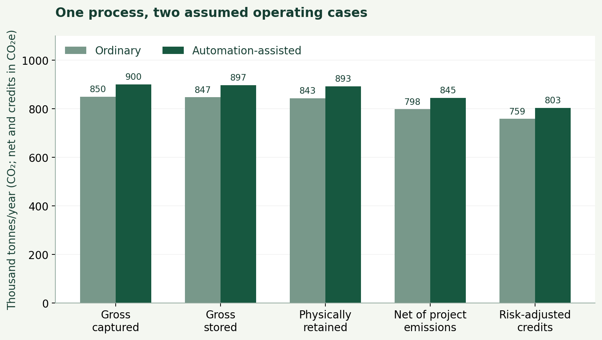
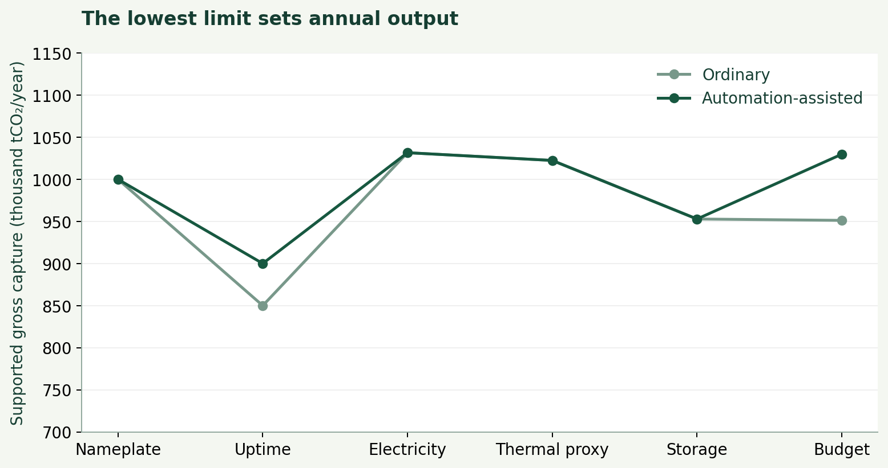
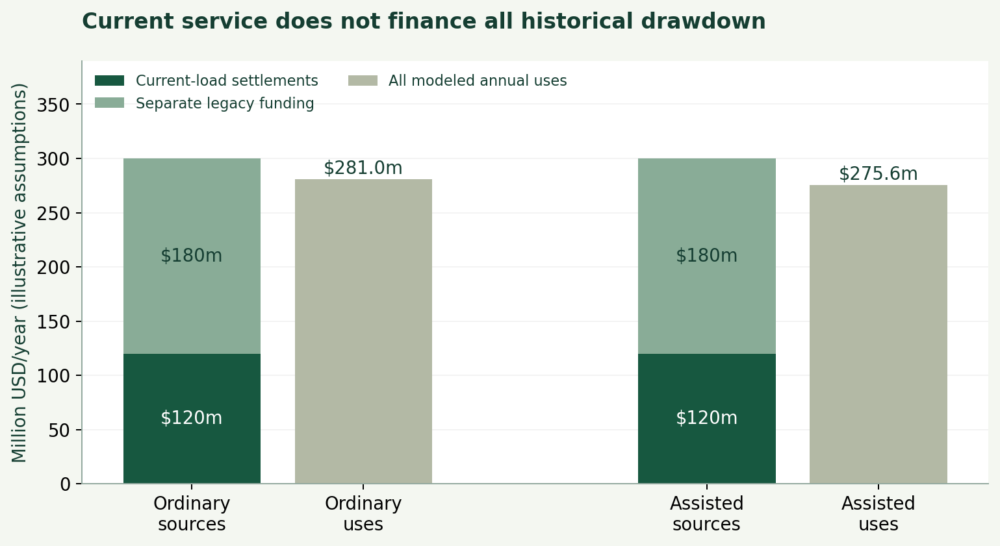

# AETHER: Atmospheric Engineering Through High-Energy Removal

## A conditional analysis of carbon-removal service architecture and an illustrative regional case

**Author:** Noah Hicks
**Version:** v0.46, September 2026
**Status:** Working paper; internal revision, not externally peer reviewed or engineering-certified

## Abstract

AETHER studies a public-carbon-service proposition: useful industrial activity could be paired with accountable atmospheric-stock management that measures releases, prevents avoidable emissions, and procures verified durable removal for the remainder. It is not a case for treating carbon dioxide as morally suspect or for making direct air capture (DAC) the sole answer. Capturing concentrated industrial CO2 before it disperses, process substitution, demand reduction, and durable atmospheric removal are service options. The appropriate portfolio depends on delivered physical performance, lifecycle emissions, permanence, and accountability.

This revision replaces a broad, version-history-heavy 100 GtCO2/year narrative with a bounded analytical program. A 100 GtCO2/year **gross** removal target remains only as an extreme stress test. It is neither an optimum, a forecast, nor a build recommendation. First-order arithmetic establishes why the target is demanding: at 1--3 GJ/tCO2 of capture energy, it requires about 27,800--83,300 TWh/year before transport, compression, storage, and process-specific thermal losses. Current removal is orders of magnitude smaller, and durable, creditable, and net-climate quantities are smaller than gross capture.

The legacy model suite is useful for locating constraints but does not constitute one validated coupled forecast. A corrected representative-day storage diagnostic reduces its strongest synthetic regional case from 121.97 to approximately 98.40 GtCO2/year when cyclic storage is imposed; it is still not an 8760-hour, weather-resolved result. The former carbon trajectory lacked a historically initialized evolving baseline, and legacy cost, lifecycle, and uncertainty results need tighter interpretation. This paper therefore treats the quantitative suite as a partially integrated screening system. Its immediate research objective is a reproducible 1 MtCO2/year regional analytical case comparing ordinary and automation-assisted execution under the same physical conditions, followed by independently reviewable carbon, power, storage, lifecycle, and finance work.

## 1. Question, boundary, and contribution

AETHER asks whether atmospheric carbon management could eventually be operated as durable public infrastructure rather than as a collection of loosely comparable offset claims. That question is long-horizon. It becomes meaningful only if operations can be measured, capital can be financed, storage obligations can survive operators, and the service does not weaken the incentive to stop avoidable emissions.

The project does not assume that CO2 is intrinsically bad. CO2 is a material used in biology and industry; the problem addressed here is the accumulated atmospheric perturbation and the harms associated with it. A carbon service is therefore an accounting-and-operations proposal. It records releases and removals, chooses the least harmful technically feasible intervention, holds reserves against reversal or invalidation, and separates scientific measurement from commercial claims.

The central research question is conditional:

> What physical, financial, and institutional conditions would have to hold for an automation-assisted carbon-removal service to deliver verified durable net atmospheric benefit at industrial scale?

The 100 GtCO2/year figure is retained to make those conditions visible. It exceeds contemporary annual anthropogenic CO2 emissions and dwarfs present novel CDR. It should not become the identity of the project. A smaller, well-accounted service would be more informative than a larger number supported by disconnected assumptions.

The contribution is an explicit service architecture plus a constraint-first research program. The architecture connects four questions that are often discussed separately: what is physically captured, what remains stored, what can legitimately be credited, and who bears the cost if a store leaks or a claim fails. The research program uses automation as a mechanism to test, not an assumed answer. It asks whether automation changes construction time, maintenance hours, plant availability, monitoring cost, drilling, or materials discovery while holding the underlying process, power, and storage conditions fixed.

This is adjacent to, rather than a replacement for, established CDR and DAC work. The [IPCC AR6 Working Group III technical summary](https://www.ipcc.ch/report/ar6/wg3/chapter/technical-summary/), [National Academies](https://nap.nationalacademies.org/catalog/25259/negative-emissions-technologies-and-reliable-sequestration-a-research-agenda), [State of CDR](https://www.stateofcdr.org/report/3rd-edition), and [Roads to Removal](https://roadstoremoval.org/) provide the broader evidence base. [Realmonte et al. (2019)](https://www.nature.com/articles/s41467-019-10842-5) show DACCS roles in modeled deep-mitigation pathways, while [Chatterjee and Huang (2020)](https://www.nature.com/articles/s41467-020-17203-7) and [Young et al. (2023)](https://www.sciencedirect.com/science/article/pii/S2590332223003007) make the scale, energy, materials, and cost objections concrete. AETHER does not overturn that literature.

## 2. What is known, calculated, and assumed

The paper distinguishes evidence from scenario construction. A source-backed anchor may be stated as a present fact. A derived result is arithmetic or a model output whose inputs are shown. A scenario assumption tests a condition but is not a forecast. A research hypothesis remains a question even when it is operationally attractive.

Atmospheric CO2 remains high and rising: NOAA's preliminary May 2026 global monthly mean was 428.73 ppm, while the Global Carbon Budget reported approximately 42.2 GtCO2/year of anthropogenic emissions for 2025 ([NOAA GML, 2026](https://www.gml.noaa.gov/ccgg/trends/global.html); [Friedlingstein et al., 2026](https://essd.copernicus.org/articles/18/3211/2026/)). State of CDR reports roughly 2.2 GtCO2/year of current CDR, almost all conventional land-based removal, and only about 2 MtCO2/year of novel CDR ([State of CDR, 2026](https://www.stateofcdr.org/report/3rd-edition)). These anchors establish scale; they do not validate an AETHER deployment path.

For every pathway, the relevant quantities are distinct:

| Layer | Meaning | It does not establish |
|---|---|---|
| Gross removal | CO2 enters a capture or removal process. | Permanent atmospheric benefit. |
| Physical retention (CO2) | Captured carbon remaining stored after delivery losses and the stated retention treatment. | Benefit after project emissions. |
| Net accounting (CO2e) | Physical retention minus the full modeled lifecycle-emissions debit; this can be negative. | A complete climate response or marketable credit. |
| Risk-adjusted credits (CO2e) | Nonnegative eligible net accounting after measurement and risk buffers. | A time- and species-resolved climate result. |
| Net climate result | Carbon-cycle and climate response to intervention, including residual and induced emissions. | A validated forecast without a tested climate model. |

For a simplified annual ledger, retained gross is `gross capture x retention`; lifecycle CO2e is a separate debit; and a provisional credit buffer is applied only after those physical terms are stated. The net-after-lifecycle value remains signed: a negative value is a reported net burden, not zero removal. Only credit issuance is floored at zero. This scalar ledger is not a time- and species-resolved climate model. Electricity, useful heat at its required temperature, and chemical energy are also separate inputs. A thermal GJ cannot silently substitute for delivered electrical GJ. Process and power integration can materially change the outcome ([Mohan et al., 2024](https://zero.lab.princeton.edu/wp-content/uploads/2025/01/Mohan-et-al.-2024-Direct-air-capture-integration-with-low-carbon-heat.pdf)).

At 100 GtCO2/year, 1, 3, and 10 GJ/tCO2 correspond to about 27,800, 83,300, and 277,800 TWh/year, respectively. These are transparent unit conversions, not estimates of likely future energy intensity. The IPCC describes DACCS energy and resource constraints; a physical minimum cannot be treated as a deployable plant design ([IPCC, 2022](https://www.ipcc.ch/report/ar6/wg3/chapter/chapter-12/)). Converting captured CO2 to elemental carbon is a special-purpose branch, not a default storage path: its thermodynamic burden alone is substantial and real engineering losses would be additional.

## 3. The regional analytical case

The current quantitative center is a 1 MtCO2/year regional analytical benchmark, not a recommendation to build a plant. It holds the process-energy proxy, storage route, and funding boundary constant while comparing ordinary execution with automation-assisted execution. The process anchor is NETL's solvent DAC Case 1 ([NETL, 2022](https://www.netl.doe.gov/projects/files/DirectAirCaptureCaseStudiesSolventSystem_083122.pdf)): 0.533129 MWh/tCO2 of auxiliary electricity and 6.846332 GJ_HHV/tCO2 of calciner natural-gas input. The latter is a fuel-input-equivalent thermal-service proxy, not measured useful heat. Substitution with low-carbon supply requires temperature, conversion-efficiency and process-integration assumptions that this benchmark does not establish. These are not general DAC performance estimates.

In the matched mechanism test, ordinary operations capture 850,000 gross tonnes/year and the automation-assisted case captures 900,000. The difference is attributed only to assumed uptime rising from 0.85 to 0.90. Automation-task hours fall from 660,000 to 345,000/year, while the automation case adds a $12 million system cost at the same $85/hour task-cost rate. Both cases remain uptime-limited and share their specified electricity, heat, storage, and wider cost/funding assumptions. Automation cannot overcome constrained electricity, heat, or storage.

| Analytical result (tCO2/year unless stated) | Ordinary | Automation-assisted |
|---|---:|---:|
| Gross captured | 850,000.0 | 900,000.0 |
| Gross stored | 847,451.7 | 897,301.8 |
| Project emissions (tCO2e) | 45,090.7 | 47,743.1 |
| Retained stored CO2 | 843,214.4 | 892,815.3 |
| Net retained after project-emissions debit | 798,123.7 | 845,072.2 |
| Risk-adjusted credits | 758,696.4 | 803,325.6 |

This is an analytical mechanism test, not field validation or a forecast. The storage and credit terms use a stated EPA-informed MRV boundary ([U.S. EPA, 2026](https://www.epa.gov/ghgreporting/subpart-rr-geologic-sequestration-carbon-dioxide)); risk-adjusted credits are not an independent net-climate result. The case must still identify construction and operational emissions, liability, reversal reserves, and failure sensitivity for the automation premise. Its reproducible inputs and calculations accompany the regional-reference artifact.

A narrower corrected diagnostic already illustrates why accounting boundaries matter. The legacy regional dispatch script started each representative day with partly charged storage and annualized one day without requiring the terminal state of charge to equal the initial state. A cyclic fixed-point boundary applied to the same synthetic profiles yields approximately 9.87, 33.47, 42.72, 98.40, and 3.62 GtCO2/year for its five named cases, rather than the published 15.46, 47.93, 64.26, 121.97, and 10.19. The strongest case therefore no longer clears 100 GtCO2/year. This is a conservation diagnostic, not an 8760-hour result or a forecast; weather, transmission, maintenance, demand, and interannual variability remain outside it.

The storage correction does not invalidate every energy screen, but it makes the integration requirement non-negotiable. Favorable values from standalone pathway, power, storage, robotics, or cost screens cannot be assembled into a common scenario unless they share time, location, resources, accounting layers, and dependencies. Biomass, minerals, land, water, clean power, transport, and pore space are portfolio constraints, not independent columns to add.

## 4. Carbon and climate boundary

Gross tonnage is not atmospheric concentration change. Land and ocean reservoirs respond to a drawdown; negative and positive CO2 pulses can be asymmetric ([Joos et al., 2013](https://acp.copernicus.org/articles/13/2793/2013/); [Zickfeld et al., 2021](https://www.nature.com/articles/s41558-021-01061-2)). The old AETHER carbon screen placed a fixed contemporary concentration beneath future pulse calculations. In a zero-future-emissions, zero-removal diagnostic, that construction remained exactly flat through 2100. It was therefore not a historically initialized baseline and must not support an atmospheric forecast.

The intended replacement boundary uses a published evolving emissions baseline with historical context, paired to a removal perturbation while holding non-removal assumptions constant. Its first source-faithful SSP2-4.5-plus-Joos implementation produced an implausible zero-future-emissions response under large off-reference anomalies: after falling, concentration rose to 433.368307 ppm from a 426.582160 ppm initial value. Its absolute concentration and temperature outputs are quarantined pending a source-based reservoir-initialization resolution. They support no target-date or validated climate claim. When reinstated, the result must be labelled a **hybrid conditional baseline**, not a calibrated Earth-system spin-up or validated forecast. The marginal effect of removal must be reported separately from changed fossil emissions, methane, aerosols, land use, or energy policy. A forcing-mode run cannot repair an upstream concentration trajectory that lacks this separation.

The project retains approximately 280 ppm as a long-horizon investigational restoration aspiration and a preindustrial reference range ([IPCC, 2021](https://www.ipcc.ch/report/ar6/wg1/chapter/chapter-2/)). It is not a demonstrated modern optimum, a safe control setpoint, or an achievable date. Decisions about a future concentration range involve regional climate, ocean chemistry, food systems, equity, uncertainty, and legitimate political authority. This paper establishes none of those choices.

## 5. A service that can remain solvent

A public-carbon service requires physical and financial stock-flow accounting. It cannot fund current cleanup with an unexamined assumption that a fee on continuing emissions will cover historical drawdown forever. At a 42.2 GtCO2/year emissions base, removing 100 GtCO2/year at $50/t costs $5 trillion/year, whereas a $50/t charge raises $2.11 trillion/year. The $2.89 trillion gap is arithmetic before administration, reserves, capital costs, or distributional choices; covering that removal bill entirely with the same emissions base would imply roughly $118/t. These figures are illustrations, not a tariff proposal or economic forecast.

The service must therefore identify separate accounts for operations, capital, legacy drawdown, post-closure monitoring, reversal reserves, and a declining emissions-revenue base. It must also choose among prevention, concentrated-source capture, process change, and atmospheric removal instead of paying a premium to retrieve every tonne after dilution. [Jenkins et al. (2021)](https://ora.ox.ac.uk/objects/uuid%3A3eebf969-1661-4484-a510-89470602cada) offer a relevant precedent in carbon takeback obligations: suppliers can be required progressively to recapture and store carbon associated with their products. AETHER's potential addition is an automation-enabled operating and accountability architecture, not priority over earlier policy work.

The regional benchmark demonstrates the separation rather than choosing a policy. It applies an assumed $200/tCO2 current-load settlement to a 600,000-tCO2/year modeled obligation and a separate $180 million/year legacy-drawdown funding stream. In its ordinary case, total sources are $300 million/year and distinct modeled uses are about $281.0 million/year; in the automation-assisted case, they are about $275.6 million/year. If legacy funding is removed, the ordinary case cannot cover fixed annual uses and the assisted case is budget-limited to about 72,712 gross tCO2/year. These are scenario outputs, not a tariff recommendation or an assertion that public funding is available. They show why an emissions fee and historical cleanup should not be treated as the same account.

Institutional forms are mechanisms with different tradeoffs. A regulated operator can concentrate technical expertise but needs independent measurement and enforcement. Public procurement can direct demand but may expose taxpayers to delivery failure. Private operators may move quickly but need liability, monitoring, and anti-conflict controls. Regional arrangements may fit storage geology and grids better than a global body but create coordination gaps. None should combine target setting, operation, credit issuance, verification, and adjudication without meaningful separation. Public oversight does not itself remove conflicts of interest.

## 6. Automation, uncertainty, and the 100 Gt stress test

AI and robotics are scenario context, not physical evidence. [McQueen and Drennan (2024)](https://www.frontiersin.org/journals/climate/articles/10.3389/fclim.2024.1415642/full) discuss warehouse automation as a possible route to scalable DAC design, and [Giro et al. (2023)](https://www.nature.com/articles/s41524-023-01088-3) demonstrate automated materials discovery for carbon-capture membranes. Those contributions motivate testable pathways, not a claim that general-purpose systems will produce climate infrastructure at a given rate. AI 2027, AI 2040, and *Situational Awareness* may be useful timing scenarios; none supplies a field productivity distribution, well-permitting rate, sorbent lifetime, or power buildout rate.

The legacy Monte Carlo and correlated-abundance outputs remain scenario screens. Their distributions were hand-set; their pass shares are not real-world probabilities, expected outcomes, or confidence intervals. Correlated scenarios also change marginal assumptions, so a favorable result cannot be attributed to correlation alone. Their useful purpose is to identify break-even surfaces: removal supported for a stated power budget, injection rate, lifecycle debit, cost, and verified productivity. An integrated screen remains partial until it ingests those upgraded outputs under one scenario contract.

The 100 Gt stress test is still useful because it exposes failures that smaller spreadsheets can hide. It forces a decision about heat versus power, annual energy versus deliverable hourly energy, storage throughput versus pore-space totals, gross capture versus durable removal, and revenue versus liabilities. It does not demonstrate practical viability. Under the current evidence, a large system remains an upper-tail conditional possibility that requires several independent gates to clear together.

Deliberately changing atmospheric composition at planetary scale resembles a limited form of terraforming in the literal sense. That analogy raises the standard for consent, monitoring, reversibility, liability, and international coordination; it does not make Earth a controllable machine. Some underlying capabilities, including autonomous construction, gas separation, mineralization, and environmental monitoring, could eventually matter for closed habitats or other celestial bodies. AETHER makes no readiness, transferability, or deployment claim beyond Earth.

## 7. Open questions and conclusion

This working paper cannot provide field validation or external peer review. Its finite open questions are deliberately concrete:

1. Can a historically initialized, paired carbon-and-climate workflow isolate removal's marginal effect under stated non-CO2 assumptions?
2. Can a regional 8760-hour power-and-heat model deliver additional low-carbon energy to a named 1 MtCO2/year process with cyclic storage, transmission, and ordinary demand included?
3. Can a basin-level storage and MRV plan support the required injection, monitoring, liability, and credit buffers?
4. Does automation improve a named physical bottleneck under measured or well-bounded productivity assumptions?
5. Can the service remain solvent while funding legacy drawdown and post-closure obligations as emissions-fee revenue falls?

The practical next result is not a larger deployment curve. It is one regional result that a carbon-cycle researcher, process-and-power engineer, storage specialist, and public-finance reviewer can reproduce and challenge without accepting the rest of the project. If that result fails, the correct outcome is a narrower claim. If it survives, it becomes a better starting point for a serious public-carbon-service research program.

## References

- [Chatterjee, S., & Huang, K. (2020). *Unrealistic energy and materials requirement for direct air capture in deep mitigation pathways*. Nature Communications.](https://www.nature.com/articles/s41467-020-17203-7)
- [Friedlingstein, P., et al. (2026). *Global Carbon Budget 2025*. Earth System Science Data.](https://essd.copernicus.org/articles/18/3211/2026/)
- [Giro, R., et al. (2023). *AI powered, automated discovery of polymer membranes for carbon capture*. npj Computational Materials.](https://www.nature.com/articles/s41524-023-01088-3)
- [IPCC. (2021). *Climate Change 2021: The Physical Science Basis. Working Group I contribution to the Sixth Assessment Report*.](https://www.ipcc.ch/report/ar6/wg1/)
- [IPCC. (2022). *Climate Change 2022: Mitigation of Climate Change. Working Group III contribution to the Sixth Assessment Report*.](https://www.ipcc.ch/report/ar6/wg3/)
- [Jenkins, S., Mitchell-Larson, E., Ives, M. C., Haszeldine, S., & Allen, M. (2021). *Upstream decarbonization through a carbon takeback obligation: An affordable backstop climate policy*. Joule, 5(11), 2777--2796.](https://ora.ox.ac.uk/objects/uuid%3A3eebf969-1661-4484-a510-89470602cada)
- [Joos, F., et al. (2013). *Carbon dioxide and climate impulse response functions for the computation of greenhouse gas metrics: a multi-model analysis*. Atmospheric Chemistry and Physics, 13, 2793–2825.](https://doi.org/10.5194/acp-13-2793-2013)
- [McQueen, N., & Drennan, C. (2024). *The use of warehouse automation technology for scalable and low-cost direct air capture*. Frontiers in Climate.](https://www.frontiersin.org/journals/climate/articles/10.3389/fclim.2024.1415642/full)
- [Mohan, A., et al. (2024). *Direct air capture integration with low-carbon heat: Process engineering and power system analysis*.](https://zero.lab.princeton.edu/wp-content/uploads/2025/01/Mohan-et-al.-2024-Direct-air-capture-integration-with-low-carbon-heat.pdf)
- [National Energy Technology Laboratory. (2022). *Direct air capture case studies: solvent system*.](https://www.netl.doe.gov/projects/files/DirectAirCaptureCaseStudiesSolventSystem_083122.pdf)
- [NOAA Global Monitoring Laboratory. (2026). *Trends in atmospheric carbon dioxide: Global monthly mean CO2*.](https://www.gml.noaa.gov/ccgg/trends/global.html)
- [Realmonte, G., et al. (2019). *An inter-model assessment of the role of direct air capture in deep mitigation pathways*. Nature Communications.](https://www.nature.com/articles/s41467-019-10842-5)
- [State of Carbon Dioxide Removal. (2026). *The State of Carbon Dioxide Removal: 3rd Edition*.](https://www.stateofcdr.org/report/3rd-edition)
- [Young, J., et al. (2023). *The cost of direct air capture and storage can be reduced via strategic deployment but is unlikely to fall below stated cost targets*. One Earth.](https://www.sciencedirect.com/science/article/pii/S2590332223003007)
- [Zickfeld, K., et al. (2021). *Asymmetry in the climate-carbon cycle response to positive and negative CO2 emissions*. Nature Climate Change.](https://www.nature.com/articles/s41558-021-01061-2)
